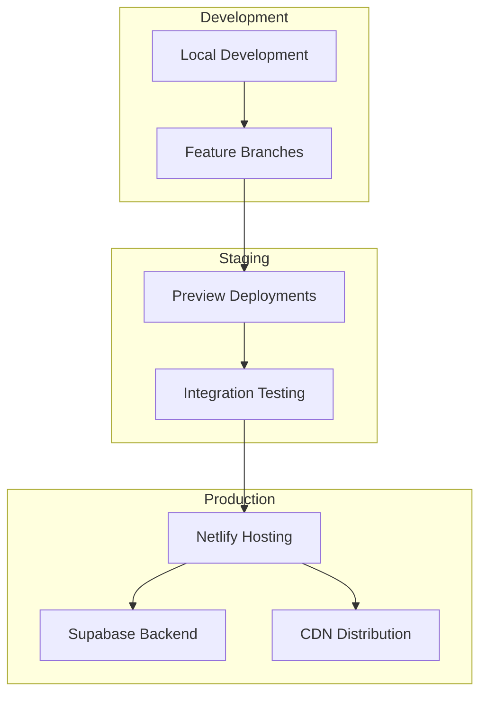

# 🧠 EngageAI - Event Engagement Tracking Platform


[](https://zesty-sopapillas-8c9b7c.netlify.app)
[](https://reactjs.org/)
[](https://www.typescriptlang.org/)
[](https://supabase.com/)
[](https://tailwindcss.com/)
[](https://vitejs.dev/)

> **Transform event attendance into meaningful engagement with AI-powered insights, real-time tracking, and beautiful analytics.**

## 🌟 Live Demo

🚀 **[View Live Application](https://zesty-sopapillas-8c9b7c.netlify.app)**

## 📋 Table of Contents

- [🎯 Overview](#-overview)
- [✨ Key Features](#-key-features)
- [🏗️ Architecture](#️-architecture)
- [🛠️ Technology Stack](#️-technology-stack)
- [📊 Database Schema](#-database-schema)
- [🚀 Getting Started](#-getting-started)
- [🔧 Configuration](#-configuration)
- [📱 User Roles & Permissions](#-user-roles--permissions)
- [🤖 AI Integration](#-ai-integration)
- [📈 Analytics & Insights](#-analytics--insights)
- [🎮 Gamification System](#-gamification-system)
- [🔒 Security & Privacy](#-security--privacy)
- [📚 API Documentation](#-api-documentation)
- [🧪 Testing](#-testing)
- [🚀 Deployment](#-deployment)
- [🤝 Contributing](#-contributing)
- [📄 License](#-license)

## 🎯 Overview

EngageAI bridges the gap between event attendance and actual engagement through intelligent tracking, AI-powered analysis, and beautiful visualizations. Built for educational institutions, corporate training, and professional events.

### 🎪 Core Problem Solved

| Traditional Event Tracking | EngageAI Solution |
|----------------------------|-------------------|
| ❌ Basic attendance counting | ✅ Multi-dimensional engagement scoring |
| ❌ No real-time insights | ✅ Live engagement monitoring |
| ❌ Manual feedback collection | ✅ AI-powered sentiment analysis |
| ❌ Static reporting | ✅ Interactive analytics dashboard |
| ❌ No participant motivation | ✅ Gamification & achievement system |

## ✨ Key Features

### 🧠 **Engagement Scoring Engine**


### 📊 **Multi-Dashboard System**

| Dashboard Type | Target Users | Key Metrics |
|---------------|--------------|-------------|
| **Student Dashboard** | Learners, Participants | Personal engagement score, achievements, session history |
| **Organizer Dashboard** | Event hosts, Educators | Session analytics, participant insights, engagement heatmaps |
| **Admin Dashboard** | Platform administrators | System-wide metrics, user management, AI model performance |

### 🤖 **AI Integration Matrix**

| AI Provider | Primary Use Case | Fallback Strategy |
|-------------|------------------|-------------------|
| **Google AI (Gemini)** | Sentiment analysis, content understanding | → Groq AI |
| **Groq AI** | High-speed inference, real-time processing | → Local processing |
| **Cohere** | Text embedding, classification | → Rule-based system |

### 🎮 **Gamification Elements**


## 🏗️ Architecture

### 🔄 **System Flow Diagram**


### 📁 **Project Structure**

```
src/
├── components/           # React components
│   ├── auth/            # Authentication components
│   ├── dashboard/       # Dashboard components
│   ├── sessions/        # Session management
│   ├── analytics/       # Analytics components
│   └── shared/          # Reusable components
├── lib/                 # Utility libraries
│   ├── supabase.ts     # Database client
│   ├── ai-providers.ts # AI integration
│   └── utils.ts        # Helper functions
├── types/              # TypeScript definitions
├── hooks/              # Custom React hooks
└── styles/             # Global styles
```

## 🛠️ Technology Stack

### **Frontend Technologies**

| Technology | Version | Purpose |
|-----------|---------|---------|
| **React** | 18.3.1 | UI framework |
| **TypeScript** | 5.5.3 | Type safety |
| **Vite** | 5.4.2 | Build tool |
| **Tailwind CSS** | 3.4.1 | Styling |
| **Lucide React** | 0.344.0 | Icons |
| **React Router** | 7.7.0 | Navigation |

### **Backend & Database**

| Service | Purpose | Features |
|---------|---------|----------|
| **Supabase** | Backend-as-a-Service | Authentication, Database, Real-time, Storage |
| **PostgreSQL** | Primary database | ACID compliance, JSON support, Full-text search |
| **Row Level Security** | Data protection | User-level data isolation |

### **AI & External Services**

| Provider | Integration Type | Use Cases |
|----------|------------------|-----------|
| **Google AI (Gemini)** | REST API | Sentiment analysis, content summarization |
| **Groq** | REST API | High-speed inference, real-time processing |
| **Cohere** | REST API | Text classification, embeddings |
| **Zoom** | SDK/Webhooks | Meeting integration, attendance tracking |

## 📊 Database Schema

### **Core Tables Overview**


### **Detailed Schema**

<details>
<summary><strong>📋 Click to expand full database schema</strong></summary>

#### **profiles**
| Column | Type | Description |
|--------|------|-------------|
| `id` | UUID | Primary key, references auth.users |
| `name` | TEXT | User's full name |
| `organization` | TEXT | User's organization/company |
| `role` | TEXT | User role (student/admin/moderator) |
| `engagement_score` | INTEGER | Overall engagement score |
| `total_events` | INTEGER | Total events attended |
| `badges` | TEXT[] | Array of earned badges |
| `avatar_url` | TEXT | Profile picture URL |

#### **user_preferences**
| Column | Type | Description |
|--------|------|-------------|
| `id` | UUID | Primary key |
| `user_id` | UUID | Foreign key to auth.users |
| `google_api_enabled` | BOOLEAN | Google AI integration status |
| `groq_api_enabled` | BOOLEAN | Groq AI integration status |
| `google_api_key` | TEXT | Encrypted Google API key |
| `groq_api_key` | TEXT | Encrypted Groq API key |
| `notification_*` | BOOLEAN | Various notification preferences |
| `privacy_*` | BOOLEAN | Privacy settings |

#### **sessions**
| Column | Type | Description |
|--------|------|-------------|
| `id` | UUID | Primary key |
| `title` | TEXT | Session title |
| `description` | TEXT | Session description |
| `organizer` | TEXT | Organizer name |
| `organizer_id` | UUID | Foreign key to auth.users |
| `date` | DATE | Session date |
| `start_time` | TIME | Start time |
| `end_time` | TIME | End time |
| `status` | TEXT | upcoming/live/completed/cancelled |
| `type` | TEXT | virtual/hybrid/in-person |
| `attendees` | INTEGER | Current attendee count |
| `max_attendees` | INTEGER | Maximum capacity |
| `engagement_score` | INTEGER | Average engagement score |
| `tags` | TEXT[] | Session tags |
| `meeting_url` | TEXT | Virtual meeting link |

</details>

## 🚀 Getting Started

### **Prerequisites**

- Node.js 18+ 
- npm or yarn
- Supabase account
- AI provider API keys (optional)

### **Installation Steps**

1. **Clone the repository**
   ```bash
   git clone https://github.com/your-username/engageai.git
   cd engageai
   ```

2. **Install dependencies**
   ```bash
   npm install
   ```

3. **Environment setup**
   ```bash
   cp .env.example .env
   ```
   
   Configure your `.env` file:
   ```env
   VITE_SUPABASE_URL=your_supabase_url
   VITE_SUPABASE_ANON_KEY=your_supabase_anon_key
   ```

4. **Database setup**
   ```bash
   # Run Supabase migrations
   npx supabase db push
   ```

5. **Start development server**
   ```bash
   npm run dev
   ```

### **Quick Setup Checklist**

- [ ] Supabase project created
- [ ] Environment variables configured
- [ ] Database migrations applied
- [ ] Development server running
- [ ] Authentication working
- [ ] Sample data loaded (optional)

## 🔧 Configuration

### **Supabase Configuration**

#### **Authentication Settings**
```sql
-- Enable email confirmation (optional)
UPDATE auth.config SET enable_signup = true;
UPDATE auth.config SET enable_confirmations = false; -- For development
```

#### **Row Level Security Policies**
```sql
-- Example policy for profiles table
CREATE POLICY "Users can view own profile" ON profiles
  FOR SELECT USING (auth.uid() = id);

CREATE POLICY "Users can update own profile" ON profiles
  FOR UPDATE USING (auth.uid() = id);
```

### **AI Provider Setup**

#### **Google AI (Gemini)**
1. Visit [Google AI Studio](https://makersuite.google.com/app/apikey)
2. Create API key
3. Add to user preferences in app

#### **Groq**
1. Visit [Groq Console](https://console.groq.com/keys)
2. Generate API key
3. Configure in preferences

### **Environment Variables Reference**

| Variable | Required | Description |
|----------|----------|-------------|
| `VITE_SUPABASE_URL` | ✅ | Supabase project URL |
| `VITE_SUPABASE_ANON_KEY` | ✅ | Supabase anonymous key |
| `VITE_APP_ENV` | ❌ | Environment (dev/prod) |

## 📱 User Roles & Permissions

### **Role-Based Access Control**


### **Permission Matrix**

| Feature | Student | Moderator | Admin |
|---------|---------|-----------|-------|
| View Sessions | ✅ | ✅ | ✅ |
| Create Sessions | ❌ | ✅ | ✅ |
| Join Sessions | ✅ | ✅ | ✅ |
| View Own Analytics | ✅ | ✅ | ✅ |
| View All Analytics | ❌ | ✅ | ✅ |
| Manage Users | ❌ | ❌ | ✅ |
| System Configuration | ❌ | ❌ | ✅ |
| AI Model Management | ❌ | ❌ | ✅ |

## 🤖 AI Integration

### **Multi-Model Architecture**


### **AI Use Cases**

| Use Case | Primary Model | Fallback | Processing Time |
|----------|---------------|----------|-----------------|
| **Sentiment Analysis** | Gemini | Groq | ~200ms |
| **Question Classification** | Groq | Local Rules | ~100ms |
| **Content Summarization** | Gemini | Cohere | ~500ms |
| **Real-time Scoring** | Groq | Local Algorithm | ~50ms |

### **Implementation Example**

```typescript
// AI Provider Integration
class AIService {
  async analyzeSentiment(text: string): Promise<SentimentResult> {
    try {
      // Try Gemini first
      return await this.geminiAnalysis(text);
    } catch (error) {
      try {
        // Fallback to Groq
        return await this.groqAnalysis(text);
      } catch (fallbackError) {
        // Local processing
        return this.localSentimentAnalysis(text);
      }
    }
  }
}
```

## 📈 Analytics & Insights

### **Engagement Metrics Dashboard**


### **Key Performance Indicators**

| Metric Category | Indicators | Calculation Method |
|-----------------|------------|-------------------|
| **Engagement** | Participation rate, Question frequency, Chat activity | Weighted scoring algorithm |
| **Learning** | Session completion, Resource downloads, Follow-up actions | Behavioral tracking |
| **Social** | Peer interactions, Community contributions, Collaboration | Network analysis |
| **Satisfaction** | Sentiment scores, Feedback ratings, Return rates | AI sentiment + surveys |

### **Analytics Features**

#### **Real-time Monitoring**
- Live engagement scores
- Participant activity heatmaps
- Question sentiment analysis
- Attention drop-off alerts

#### **Historical Analysis**
- Engagement trends over time
- Session performance comparisons
- User progress tracking
- Cohort analysis

#### **Predictive Insights**
- Engagement risk prediction
- Optimal session timing
- Content recommendation
- Intervention suggestions

## 🎮 Gamification System

### **Achievement Framework**


### **Badge Categories**

| Category | Examples | Unlock Criteria |
|----------|----------|-----------------|
| **Participation** | First Session, Regular Attendee, Perfect Attendance | Session attendance milestones |
| **Engagement** | Question Master, Discussion Leader, Feedback Champion | Interaction quality and quantity |
| **Learning** | Knowledge Seeker, Resource Explorer, Skill Builder | Learning behavior patterns |
| **Community** | Helpful Peer, Mentor, Collaborator | Social contribution metrics |
| **Special** | Early Adopter, Beta Tester, Ambassador | Platform engagement and advocacy |

### **Leaderboard System**

#### **Multiple Leaderboard Types**
- **Weekly Engagement**: Current week's top performers
- **Monthly Champions**: Monthly engagement leaders
- **All-time Legends**: Historical top contributors
- **Category Leaders**: Specialized achievement rankings

#### **Privacy Controls**
- Opt-in leaderboard participation
- Anonymous ranking options
- Organization-specific boards
- Public vs. private visibility

## 🔒 Security & Privacy

### **Data Protection Framework**


### **Compliance Features**

| Regulation | Implementation | Status |
|------------|----------------|--------|
| **GDPR** | Consent management, Right to deletion, Data portability | ✅ Implemented |
| **CCPA** | Privacy notices, Opt-out mechanisms, Data transparency | ✅ Implemented |
| **FERPA** | Educational record protection, Access controls | ✅ Implemented |
| **SOC 2** | Security controls, Audit logging, Incident response | 🔄 In Progress |

### **Security Measures**

#### **Authentication & Authorization**
- Multi-factor authentication support
- Role-based access control (RBAC)
- Session management and timeout
- API key encryption and rotation

#### **Data Protection**
- End-to-end encryption for sensitive data
- Regular security audits and penetration testing
- Automated vulnerability scanning
- Secure development lifecycle (SDLC)

#### **Privacy by Design**
- Data minimization principles
- Purpose limitation and use restriction
- Transparency and user control
- Privacy impact assessments

## 📚 API Documentation

### **Authentication Endpoints**

| Endpoint | Method | Description | Authentication |
|----------|--------|-------------|----------------|
| `/auth/signup` | POST | User registration | None |
| `/auth/signin` | POST | User login | None |
| `/auth/signout` | POST | User logout | Required |
| `/auth/refresh` | POST | Token refresh | Required |

### **Session Management**

| Endpoint | Method | Description | Permissions |
|----------|--------|-------------|-------------|
| `/sessions` | GET | List sessions | Authenticated |
| `/sessions` | POST | Create session | Organizer+ |
| `/sessions/:id` | GET | Get session details | Authenticated |
| `/sessions/:id` | PUT | Update session | Owner/Admin |
| `/sessions/:id/join` | POST | Join session | Authenticated |

### **Analytics Endpoints**

| Endpoint | Method | Description | Permissions |
|----------|--------|-------------|-------------|
| `/analytics/user/:id` | GET | User analytics | Self/Admin |
| `/analytics/session/:id` | GET | Session analytics | Organizer+ |
| `/analytics/system` | GET | System analytics | Admin |

### **Real-time Subscriptions**

```typescript
// Example: Subscribe to session updates
const subscription = supabase
  .channel('session-updates')
  .on('postgres_changes', {
    event: '*',
    schema: 'public',
    table: 'sessions'
  }, (payload) => {
    console.log('Session updated:', payload);
  })
  .subscribe();
```

## 🧪 Testing

### **Testing Strategy**

```mermaid
pyramid
    title Testing Pyramid
    "E2E Tests" : 10
    "Integration Tests" : 30
    "Unit Tests" : 60
```

### **Test Coverage**

| Component | Unit Tests | Integration Tests | E2E Tests |
|-----------|------------|-------------------|-----------|
| **Authentication** | ✅ | ✅ | ✅ |
| **Session Management** | ✅ | ✅ | ✅ |
| **Analytics** | ✅ | ✅ | ❌ |
| **AI Integration** | ✅ | ❌ | ❌ |
| **User Interface** | ✅ | ✅ | ✅ |

### **Running Tests**

```bash
# Unit tests
npm run test

# Integration tests
npm run test:integration

# E2E tests
npm run test:e2e

# Coverage report
npm run test:coverage
```

## 🚀 Deployment

### **Deployment Architecture**



### **Deployment Options**

| Platform | Type | Features | Cost |
|----------|------|----------|------|
| **Netlify** | Static Hosting | CDN, Preview deploys, Form handling | Free tier available |
| **Vercel** | Static Hosting | Edge functions, Analytics | Free tier available |
| **AWS Amplify** | Full-stack | CI/CD, Backend integration | Pay-as-you-go |
| **Self-hosted** | Custom | Full control, Custom domains | Infrastructure costs |

### **Environment Configuration**

#### **Production Environment**
```env
VITE_SUPABASE_URL=https://your-project.supabase.co
VITE_SUPABASE_ANON_KEY=your-production-anon-key
VITE_APP_ENV=production
```

#### **Staging Environment**
```env
VITE_SUPABASE_URL=https://your-staging-project.supabase.co
VITE_SUPABASE_ANON_KEY=your-staging-anon-key
VITE_APP_ENV=staging
```

### **CI/CD Pipeline**

```yaml
# Example GitHub Actions workflow
name: Deploy to Production
on:
  push:
    branches: [main]
jobs:
  deploy:
    runs-on: ubuntu-latest
    steps:
      - uses: actions/checkout@v3
      - uses: actions/setup-node@v3
      - run: npm ci
      - run: npm run build
      - run: npm run test
      - uses: netlify/actions/cli@master
        with:
          args: deploy --prod --dir=dist
```

## 🤝 Contributing

### **Development Workflow**

```mermaid
gitgraph
    commit id: "Initial"
    branch feature/new-feature
    checkout feature/new-feature
    commit id: "Feature work"
    commit id: "Tests added"
    checkout main
    merge feature/new-feature
    commit id: "Release"
```

### **Contribution Guidelines**

1. **Fork the repository**
2. **Create a feature branch**
   ```bash
   git checkout -b feature/amazing-feature
   ```
3. **Make your changes**
4. **Add tests for new functionality**
5. **Ensure all tests pass**
6. **Submit a pull request**

### **Code Standards**

- **TypeScript**: Strict mode enabled
- **ESLint**: Airbnb configuration
- **Prettier**: Automatic code formatting
- **Husky**: Pre-commit hooks
- **Conventional Commits**: Commit message format

### **Pull Request Process**

| Step | Description | Automated Checks |
|------|-------------|------------------|
| 1 | Create PR from feature branch | Branch protection rules |
| 2 | Code review by maintainers | Required reviewers |
| 3 | Automated testing | CI/CD pipeline |
| 4 | Manual testing if needed | QA checklist |
| 5 | Merge to main branch | Squash and merge |

## 📄 License

This project is licensed under the MIT License - see the [LICENSE](LICENSE) file for details.

### **License Summary**

```
MIT License

Copyright (c) 2025 EngageAI

Permission is hereby granted, free of charge, to any person obtaining a copy
of this software and associated documentation files (the "Software"), to deal
in the Software without restriction, including without limitation the rights
to use, copy, modify, merge, publish, distribute, sublicense, and/or sell
copies of the Software, and to permit persons to whom the Software is
furnished to do so, subject to the following conditions:

The above copyright notice and this permission notice shall be included in all
copies or substantial portions of the Software.
```

---

## 🙏 Acknowledgments

- **Supabase** for the amazing backend-as-a-service platform
- **React Team** for the incredible UI framework
- **Tailwind CSS** for the utility-first CSS framework
- **Lucide** for the beautiful icon library
- **Netlify** for seamless deployment and hosting

## 📞 Support

- **Documentation**: [GitHub Wiki](https://github.com/your-username/engageai/wiki)
- **Issues**: [GitHub Issues](https://github.com/your-username/engageai/issues)
- **Discussions**: [GitHub Discussions](https://github.com/your-username/engageai/discussions)
- **Email**: support@engageai.com

---

<div align="center">

**Built with ❤️ by the EngageAI Team**

[🌟 Star this repo](https://github.com/your-username/engageai) | [🐛 Report Bug](https://github.com/your-username/engageai/issues) | [💡 Request Feature](https://github.com/your-username/engageai/issues)

</div>